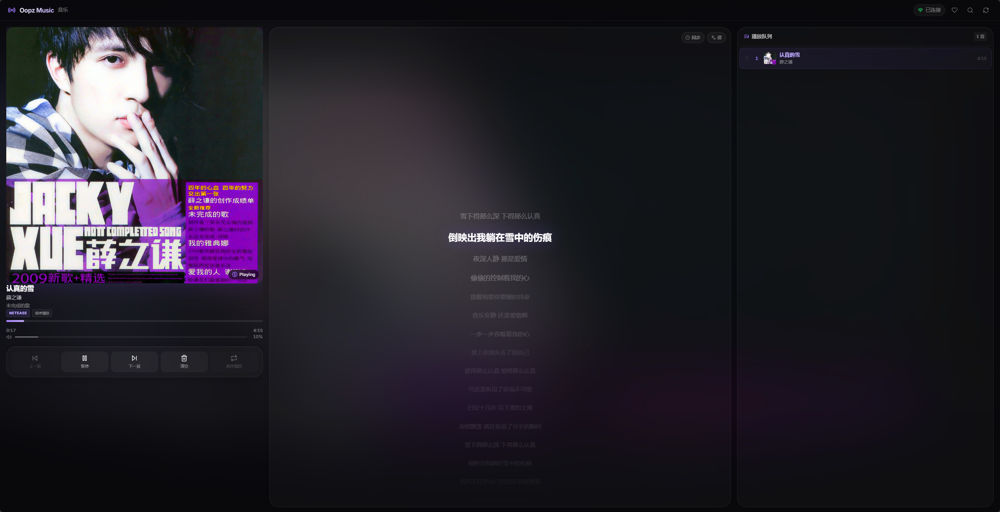
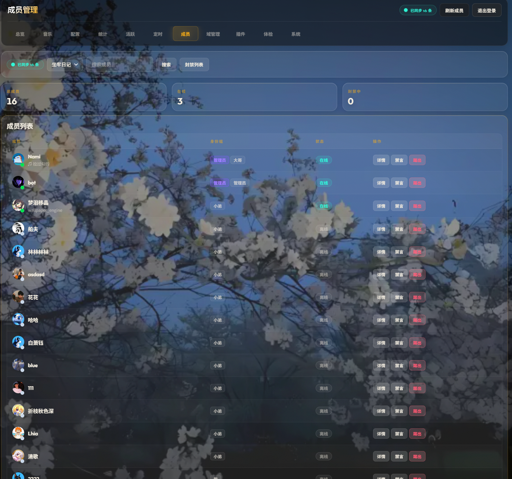
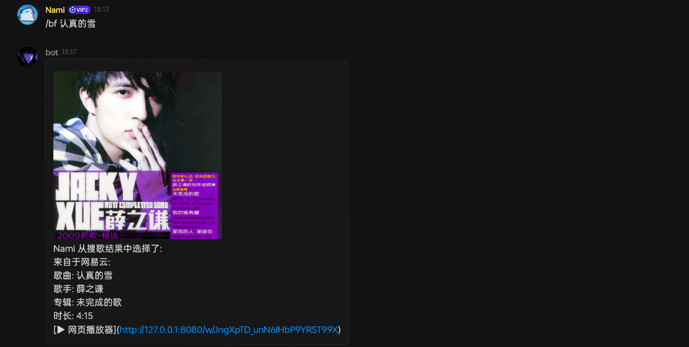
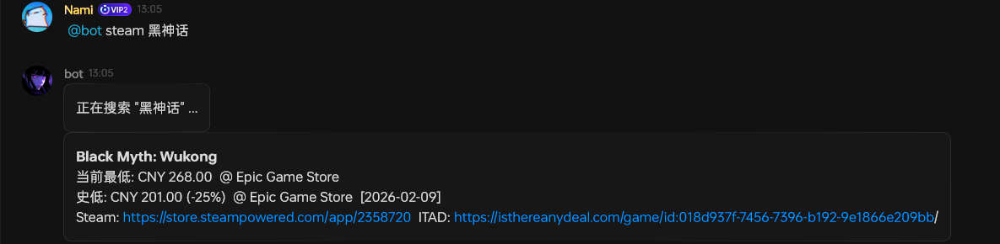

<p align="center">
  
</p>

<h1 align="center">Oopz Bot</h1>

<p align="center">
  面向 <a href="https://web.oopz.cn">Oopz</a> 的多功能频道机器人。
  <br />
  支持音乐点播、语音频道播放、AI 聊天、图片生成、频道管理、Web 播放器、管理后台和插件扩展。
</p>

<p align="center">
  <strong>开发交流：</strong>
  <a href="https://oopz.cn/i/YncsR0"><strong>加入 Oopz 交流频道</strong></a>
</p>

<p align="center">
  <a href="docs/quickstart.md">快速开始</a> ·
  <a href="#主要能力">功能特性</a> ·
  <a href="docs/commands.md">命令列表</a> ·
  <a href="docs/configuration.md">配置说明</a> ·
  <a href="docs/web-player.md">Web 播放器</a> ·
  <a href="docs/onebot-v11.md">OneBot v11</a> ·
  <a href="docs/plugin-development.md">插件开发</a>
</p>

---

## 功能展示

<table>
  <tr>
    <td width="50%" align="center">
      <strong>Web 播放器</strong>
      <br />
      <sub>搜索点歌、歌词同步、队列和播放控制</sub>
      <br /><br />
      
    </td>
    <td width="50%" align="center">
      <strong>管理后台</strong>
      <br />
      <sub>运行状态、音乐控制、配置和成员管理</sub>
      <br /><br />
      
    </td>
  </tr>
  <tr>
    <td width="50%" align="center">
      <strong>Oopz 频道指令</strong>
      <br />
      <sub>点歌、AI 回复、提醒和频道管理</sub>
      <br /><br />
      
    </td>
    <td width="50%" align="center">
      <strong>插件功能</strong>
      <br />
      <sub>三角洲、LOL、Steam 等扩展查询</sub>
      <br /><br />
      
    </td>
  </tr>
</table>

## 主要能力

| 模块 | 能做什么 |
| --- | --- |
| 音乐点播 | 网易云、QQ 音乐、B 站搜索播放，支持队列、切歌、随机播放、喜欢列表 |
| 语音播放 | Bot 可进入 Oopz 语音频道，通过 Agora 推流播放音乐 |
| Web 播放器 | 浏览器控制播放、搜索点歌、查看歌词、管理队列和音量 |
| AI 功能 | 接入豆包 AI，支持聊天回复和 Seedream 文生图 |
| 频道管理 | 成员查询、身份组、禁言、禁麦、踢出、封禁管理 |
| 自动管理 | 脏话检测、自动禁言、自动撤回、成员加入/退出通知 |
| 提醒统计 | 定时提醒、活跃排行、频道统计、点歌排行、最近播放 |
| 插件系统 | 支持目录化插件，已有三角洲、LOL、Steam 等插件 |
| 管理后台 | 提供 `/admin` 页面，方便查看状态、改配置、控音乐 |
| OneBot v11 | 可作为旁路服务接入 NoneBot、AstrBot、Hoshino 等外部程序 |

## 启动方式

### 先准备这些

- Python 3.10+
- Redis
- Node.js 18+（非 Docker 部署时用于网易云音乐 API）
- Chrome / Edge 或 Playwright Chromium（语音频道播放会用到）

### 复制配置文件

Windows PowerShell：

```powershell
Copy-Item config.example.py config.py
Copy-Item private_key.example.py private_key.py
```

Linux / macOS：

```bash
cp config.example.py config.py
cp private_key.example.py private_key.py
```

先把配置文件准备好，后面再写入 Oopz 凭据。

### 获取 Oopz 凭据

账号密码登录是主要登录方式。

**主要方式：管理后台账号密码登录**

可以直接在 `config.py` 的 `OOPZ_CONFIG` 里填写 `login_phone` 和 `login_password`。Bot 启动时会先用这两项刷新 Oopz 凭据，再继续连接 Oopz。

也可以先把 Bot 跑起来，再在后台里补齐 Oopz 凭据。打开管理后台的配置页，在“OOPZ 与网易云”里填写 Oopz 账号和密码，点击“登录并获取”。后台会先调用 Oopz 登录接口直接获取凭据；如果接口登录遇到网络或响应异常，会自动回退到浏览器登录方式。成功后会自动保存：

- `config.py`：写入 `app_version`、`device_id`、`person_uid`、`jwt_token`
- `private_key.py`：写入 RSA 私钥

这个方式对应项目里的 `src/oopz/oopz_password_login.py` 和 `/admin/api/oopz/login`，返回给页面的 Token 和私钥只展示脱敏状态。

**备用方式：命令行网页抓取**

如果后台登录不可用，或者需要手动从网页端抓取凭据，也可以用工具打开 Oopz 网页端，登录后自动抓取：

```powershell
python tools/credential_tool.py
```

自动保存：

```powershell
python tools/credential_tool.py --save
```

这个方式会从网页请求和 WebSocket 认证里提取 `person_uid`、`device_id`、`jwt_token`，并导出 RSA 私钥。详细说明见 [凭据获取工具](docs/credential-tool.md)。

### Windows 启动

先确认 Redis 已经启动，然后执行：

```powershell
pip install -r requirements.txt
python -m playwright install chromium

git clone https://github.com/NeteaseCloudMusicApiEnhanced/api-enhanced.git NeteaseAPI_tmp
Set-Location NeteaseAPI_tmp
npm install
node app.js
```

另开一个 PowerShell，回到项目根目录启动 Bot：

```powershell
python main.py
```

### Linux / macOS 启动

项目提供了 `start.sh`，会自动创建虚拟环境、安装依赖、安装 Playwright Chromium，并读取 `.env`、`.env.local`。运行前同样需要准备好 Redis。

```bash
chmod +x start.sh
./start.sh
```

第一次运行时，如果没有 `config.py` 或 `private_key.py`，脚本会自动复制模板并退出。填好配置后再运行一次：

```bash
./start.sh
```

### 网易云音乐 API

非 Docker 部署需要准备网易云音乐 API。默认地址是 `http://localhost:3000`，首次使用需要登录网易云音乐，并把 Cookie 填到 `config.py`。

如果想让 Bot 启动时自动启动网易云音乐 API，在 `config.py` 里配置：

```python
NETEASE_CLOUD["auto_start_path"] = "NeteaseAPI_tmp"
```

启动后可用这个地址检查 Bot 是否正常：

```text
http://localhost:8080/health
```

默认情况下，Web 播放器和管理后台也由 `8080` 端口提供。

如果要接 OneBot v11 生态，在 `config.py` 中启用 `ONEBOT_V11_CONFIG["enabled"] = True` 后重启，默认监听 `127.0.0.1:6700`。详见 [OneBot v11 旁路适配](docs/onebot-v11.md)。

## Docker 部署

Docker 会一起启动 Bot、Redis、网易云音乐 API 和 Nginx。

Windows PowerShell：

```powershell
docker compose up -d
```

Linux / macOS：

```bash
docker compose up -d
```

如果本机 Docker 版本较旧，也可以用：

```bash
docker-compose up -d
```

更完整的部署说明见 [快速开始](docs/quickstart.md)。

## 常用命令

| 类型 | 示例 |
| --- | --- |
| 音乐 | `@bot 播放 稻香`、`@bot 下一首`、`@bot 队列`、`@bot 随机` |
| AI | `@bot 画一只赛博猫`、`@bot 帮我写一句欢迎语` |
| 提醒 | `@bot 提醒 30分钟后 开会`、`@bot 我的提醒` |
| 管理 | `@bot 禁言 <用户> 5`、`@bot 解禁 <用户>`、`@bot 踢出 <用户>` |
| 插件 | `@bot 三角洲帮助`、`@bot 战绩 区号 召唤师#编号`、`@bot steam 黑神话` |

完整指令见 [机器人命令](docs/commands.md)。

## 插件扩展

插件放在 `plugins/` 目录，推荐一个插件一个子目录。Bot 启动时会自动扫描加载。

当前已有插件：

- 三角洲行动查询、日报、周报、资产、价格、推送
- LOL 封号查询
- LOL 战绩查询
- Steam 游戏价格查询和降价提醒
- Apex Legends 战绩与游戏信息查询
- ARC Raiders 物品与掉率查询

创建新插件：

```powershell
python tools/create_plugin_scaffold.py demo_plugin
```

插件开发说明见 [插件开发工作流](docs/plugin-development.md) 和 [plugins/README.md](plugins/README.md)。

## 注意事项

- 不要提交真实的 `config.py`、`private_key.py`、Cookie、JWT、API Key。
- Token 过期时，程序可能可以启动，但 Bot 无法正常连接 Oopz，需要重新获取凭据。
- 公开访问 Web 播放器或管理后台时，建议使用 HTTPS。
- Redis、网易云音乐 API、Oopz 凭据都正常时，Bot 才能完整工作。

## 许可证

MIT
